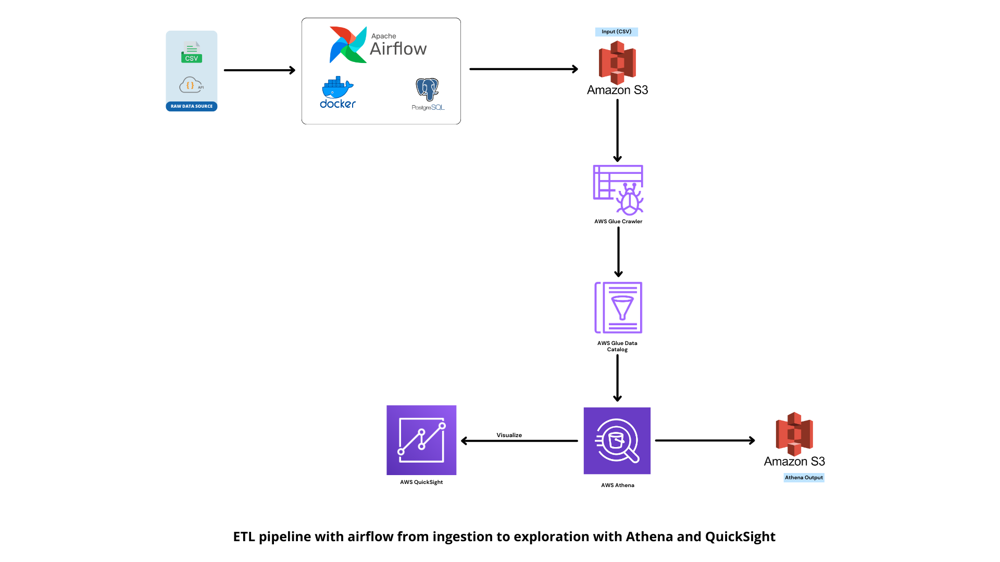

#### Note: Airflow version 2.6.3 (we use Official Docker Images)

### Apache Airflow ETL project with Postgres as a Database and AWS S3 Bucket

### How to deploy:

#### Prerequisite: Docker and docker-compose must be installed.

#### Step 1: Clone this Repo and open terminal.

#### Step 2: Create a ```.env``` file and set your environnement variables based on ```env.example```

#### Step 3 : Change ```docker-compose.yml``` file and ```dags/settings/params.py``` according to your preference. Or you can just keep them as it is for local development.

#### Step 3: Run ```docker-compose up -d```

#### Step 5: Go to ```http://localhost:8080``` and login with default user: airflow and password: airflow as specified in your .env file 

#### Note: you can view the version deployed on AWS (tag 1.0.0 on github for the sourcecode) at ```http://ec2-34-248-214-83.eu-west-1.compute.amazonaws.com:8080/```, default identifiers are airflow/airflow

### Architecture




### QuickSight

[Dashboard Image](assets/dashboard.png)
